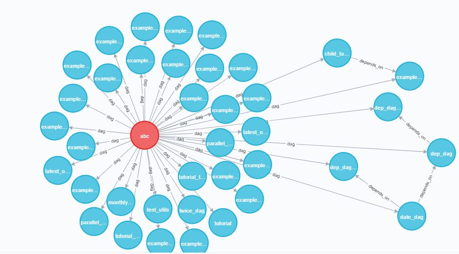

[](https://circleci.com/gh/karthikskmurthy/airflow-dag-dep/?branch=main)
[](https://www.python.org/)
<a href="https://github.com/psf/black"></a>

# airflow-dag-dep
Airflow is a data orchestration tool which is used to stick different operators together.
As the number of DAGs in airflow increases there are high changes that these dags are dependent on each other . And one way to hook these DAGs together is to use ExternalTaskSensor in downstream DAGs , so that downstream DAG will trigger only when upstream DAG is marked success.

## Getting Started
To get started with this tool, we need to have some prerequisites.

### Prerequisites

1. Python 3.*
2. Neo4j - https://neo4j.com/docs/
3. Airflow (Need to enable airflow api) - https://airflow.apache.org/docs/apache-airflow/stable/stable-rest-api-ref.html

### Note

Since we are using airflow api to get the dag metadata , in order to build the relationship make sure that the task_id of ExternalTaskSensor should be same as external_dag_id . 
```python
ExternalTaskSensor(task_id = 'date_dag', external_dag_id = 'date_dag', allowed_states = ['success'], failed_states = ['failed'])
```

### Setup

1. Clone the git repo
```sh
git clone https://github.com/karthikskmurthy/airflow-dag-dep
```
2. Install the requirements
```sh
pip install -r requirements.txt
```
3. Create a database in neo4j and add password to environment variable. Start the database.
```sh
NEO_PASSWORD=****
```
4. Make sure airflow instance is up and running .Point config.yml to your airflow instance.
5. Navigate to api folder and run uvicorn command
```sh
uvicorn main:api --reload
```
6. Hit http://localhost:8000 from any rest client to push data to neo4j

### Results

Once the data has been pushed to neo4j . We can write different cypher queries to see dag dependencies.
```
MATCH(n) return n
```
<p align="center">
  
</p>

```
MATCH(n:DAG)-[r:depends_on]-(b:DAG)
 return n,r,b
```
<p align="center">
  
</p>

```
MATCH(n:DAG)-[r:depends_on]-(b:DAG)
 where n.name = 'date_dag'
 return n,r,b
```
<p align="center">
  
</p>

### Enchancements
We can add different metadata from airflow dags to nodes and relationships and write some queries to get more insights on how the pipelines are connected to each other.


